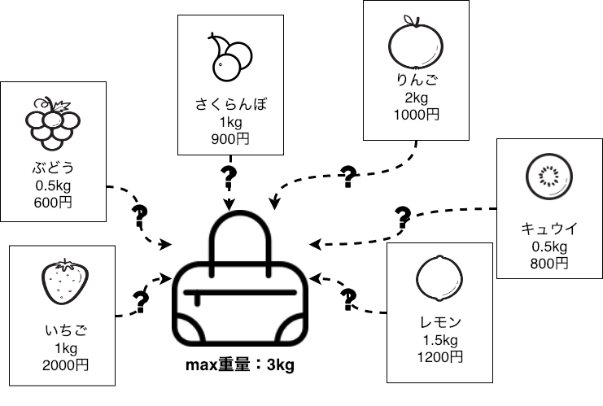

# Knapsack Problem Solver

## Intro

A knapsack problem solving library that fits with the current project I am working on.  
It uses knapsack problem solving approaches, but some of the algorithms are changed.

## Environment

OS: `macOS Mojave 10.14.2`  
python: `pyenv:python3.6.5`  
pybind11: `2.2.3`

## Installation

1. Clone this repository  
**SSH**  
```
$ git clone git@github.com:sff1019/coqua_knapsack.git
```

**HTTPS**  
```
$git clone https://github.com/sff1019/coqua_knapsack.git
```

2. pip install package  
From the parent directory install this package
```
$ pip install ./coqua_knapsack
```

## Useage Example

```
>>> import coqua_knapsack as ck
>>> ck.max(1,2)
2
```

## Knapsack


Knapsack problem is one of the most famous combinatorial optimization problem.  


## knapsack_dynamic.cpp

Solving knapsack problem using dynamic problem approach.

## knapsack_greedy.cpp

Solving knapsack problem using greedy algorithm approach.

## Refrence

setup.py: https://github.com/pybind/python_example
